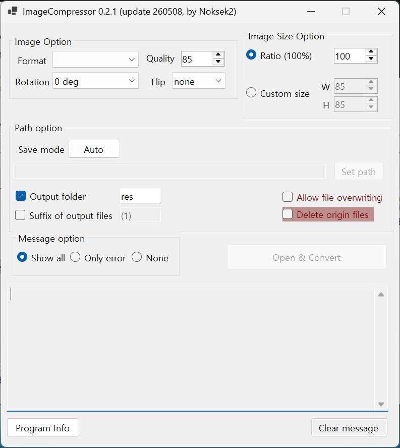

# ImageCompressor 0.2.1
## 플랫폼
- Windows 🪟 : C# Winform

## 프로그램 개발 목적 🤔
- 이미지 파일의 대량 압축, 확장자 변환 지원
- 연습용 

## 기본 사용법

1.  **옵션 설정**: 변환에 필요한 모든 옵션(포맷, 품질, 크기, 저장 경로 등)을 먼저 설정합니다.
2.  **실행**: `Open & Convert` 버튼을 클릭합니다.
3.  **파일 선택**: 파일 선택창이 열리면 변환하고 싶은 이미지 파일을 한 개 또는 여러 개 선택합니다.
4.  **결과 확인**: 선택과 동시에 변환이 자동으로 시작되며, 하단 메시지 창에서 진행 상황과 결과를 확인할 수 있습니다.

## 주요 기능 설명

### 이미지 옵션 (Image Option)

-   **포맷(Format)**: 변환할 이미지 형식(JPG, PNG 등)을 선택합니다.
-   **품질(Quality)**: 이미지의 압축 품질을 조절합니다. (숫자가 높을수록 고품질, 85~90 권장. 95 이상은 선택 불가능)
-   **회전(Rotation) 및 반전(Flip)**: 이미지를 90도 단위로 회전시키거나 좌우/상하로 뒤집습니다.

### 이미지 크기 (Image Size)

-   **비율(Ratio)**: 원본 이미지의 비율을 기준으로 크기를 조절합니다. (기본값: 100%)
-   **사용자 지정 크기(Custom size)**: 원하는 너비(W)와 높이(H) 값을 직접 입력합니다. **(주의:)**

### 경로 옵션 (Path option)

-   **경로 모드(Path mode)**: 기본 'Auto' 모드는 원본 파일이 있는 폴더에 사본을 저장합니다.
-   **결과 폴더 생성(Output folder)**: 이 옵션을 선택하면, 원본 폴더 안에 '/res' 라는 하위 폴더를 만들고 그곳에 결과물을 저장합니다.
-   **원본 파일 삭제(Delete origin files)**: 변환 완료 후 원본 파일을 삭제합니다. **(주의: 복구가 어려울 수 있습니다.)**

### 기타

-   **메시지 옵션(Message option)**: 하단 창에 표시될 메시지 종류를 선택합니다. (모두 표시, 에러만 표시, 표시 안 함)
-   **Clear message**: 하단 메시지 창의 내용을 모두 지웁니다.

## 사용 시 주의점 ⚠️
- Quality는 기본적으로 98 이상으로 설정 못 하도록 되어있습니다.
- 허용되지 않은 방법으로 변환할 경우 오류가 뜨는데, 메세지를 잘 읽어주세요.
- 사용자가 없으므로 개발 중단할 가능성 있음.
- 아직 베타버전이며, 기능 지원은 불완전합니다. 

## 버그 🐛
### v0.1.0 
webp 변환의 경우 버그가 있습니다. 용량이 너무 커지거나, 변환결과가 이상해짐. 
libwebp와 gdi+ 색상의 차이로 보임. v0.2.0에서 수정 완료

## 크로스 플랫폼 지원 예정
- Linux(Debian/Ubuntu) 🐧 : C GTK3.0

## Third-party Libraries (`./CREDITS`)
This software uses the following open-source libraries:

*  **libwebp** - [BSD 3-Clause License](https://github.com/webmproject/libwebp/blob/main/COPYING)
    Copyright (c) 2010, Google Inc. All rights reserved.
	
